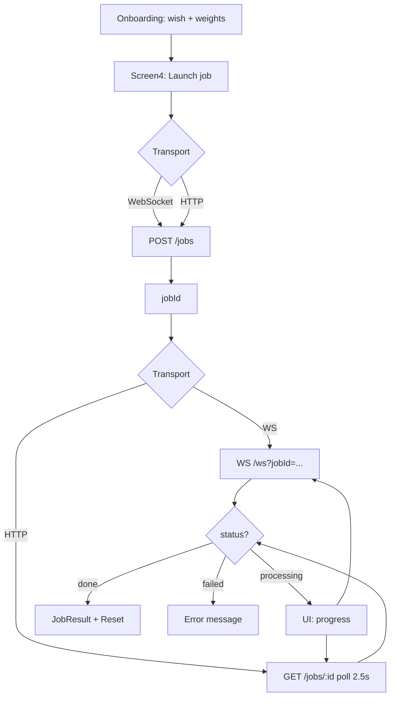

# BlockFlow Test Task

React + TypeScript + Vite застосунок з onboarding-флоу та демонстрацією обробки job через HTTP polling і WebSocket.

## Частина 0 — Проєктування

### User scenarios

**Сценарій 1 — Запуск обробки**

1. Користувач проходить onboarding (4 кроки): обирає ціль (Screen1), вводить поточну вагу (Screen2) і цільову вагу (Screen3).
2. На Screen4 («Run a job») з’являються дві кнопки: **Launch via WebSocket** або **Launch via HTTP**.
3. Після натискання обраної кнопки клієнт надсилає `POST /jobs` з `JobInput` (ціль, поточна та цільова вага) і отримує `jobId`.
4. UI переходить у стан `running`: для WebSocket показується progress bar з відсотком, для HTTP — indeterminate progress bar.

**Сценарій 2 — Отримання результату**

1. Після створення job бекенд обробляє його асинхронно.
2. **WebSocket:** клієнт підписується на `ws://…/ws?jobId=…` і отримує snapshot-и (`status`, `progress`, `result` / `error`) у реальному часі. При `done` або `failed` з’єднання закривається.
3. **HTTP:** клієнт одразу робить перший `GET /jobs/:id`, далі опитує той самий endpoint кожні 2.5 с, доки статус не стане `done` або `failed`.
4. Коли job завершено успішно, замість кнопок запуску показується картка **Result** з JSON (`summary`, `computedValue`, `finishedAt`). Кнопка **Reset** повертає onboarding на початок.

### Job processing

1. **Створення:** `JobService.create()` → `POST /jobs` → парсинг `id` / `_id` у `jobId`.
2. **Обробка на сервері:** job проходить статуси `queued` → `processing` → `done` | `failed` (логіка на бекенді, поза цим репозиторієм).
3. **Спостереження з клієнта:** два незалежні шляхи — hooks `useWebSocketJob` і `useHttpJob`, кожен викликає той самий `ApiClient.job`, але різним способом отримує оновлення.

### Оновлення статусу

| Спосіб        | Механізм                                         | Прогрес у UI                                        | Завершення                                   |
| ------------- | ------------------------------------------------ | --------------------------------------------------- | -------------------------------------------- |
| **WebSocket** | `connectJobWebSocket` → `JobService.subscribe()` | Determinate (`data.progress`)                       | `status === 'done' \| 'failed'` → disconnect |
| **HTTP**      | Polling `GET /jobs/:id` кожні 2500 ms            | Indeterminate (немає progress з API в цьому режимі) | Той самий критерій по `status`               |

Обидва шляхи використовують спільний тип `JobSnapshot` і однакову модель фаз у UI: `idle` → `running` → `done` | `error`.

### Діаграма (high-level flow)



### Архітектурні рішення

- **Шари:** UI (screens/components) → hooks (`useHttpJob`, `useWebSocketJob`) → `ApiClient` → `JobService` + `HttpClient` / `job.ws.ts`. Бізнес-логіка транспорту не змішується з розміткою.
- **Два transport hooks з однаковим контрактом:** `start(input)`, `reset()`, фази `idle | running | done | error` — Screen4 може перемикатися між режимами без дублювання API-викликів у компонентах.
- **Один сервіс для job:** `JobService` інкапсулює create, getById і subscribe; WebSocket — окремий модуль `job.ws.ts` з функцією disconnect для cleanup.
- **Конфіг через env:** `VITE_API_URL`, опційно `VITE_WS_URL` (інакше виводиться з HTTP URL).
- **Onboarding як step factory:** `getOnboardingSteps` збирає кроки декларативно; дані зберігаються в `useOnboarding`, Screen4 лише збирає `JobInput`.
- **Типізація:** `job.types.ts` — статуси, input/result/snapshot; помилки API через `ApiError`.

---

## Запуск

```bash
pnpm install
pnpm dev
```

Змінні середовища (`.env`):

```env
VITE_API_URL=https://your-api.example.com
# VITE_WS_URL=wss://your-api.example.com  # опційно
```

```bash
pnpm build
pnpm preview
```

## Стек

React 19, TypeScript, Vite, Tailwind CSS 4.
