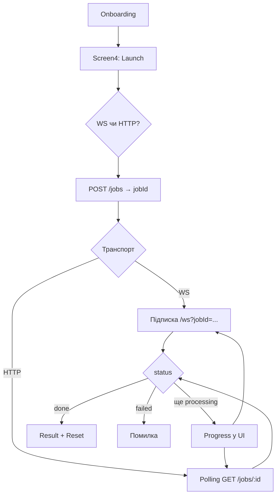

# BlockFlow Test Task

**Запуск обробки**

Користувач проходить 4 кроки: обирає ціль, вводить поточну і цільову вагу. На останньому екрані натискає **Launch via WebSocket** або **Launch via HTTP** — застосунок відправляє дані на бекенд і показує, що job уже в роботі (progress bar: з відсотком для WS, без - для HTTP).

**Отримання результату**

Поки бекенд рахує, клієнт або слухає WebSocket (`/ws?jobId=…`), або раз на ~2.5 с питає `GET /jobs/:id`. Коли приходить `done` — показується картка з результатом; якщо щось пішло не так — текст помилки. **Reset** повертає на перший крок onboarding.

### Як працює job processing

1. `POST /jobs` з даними onboarding → у відповіді `jobId`.
2. На сервері job живе своїм життям: `queued` → `processing` → `done` або `failed`.
3. У UI за цим стежать два хуки- `useWebSocketJob` і `useHttpJob`.

### Оновлення статусу: WebSocket vs HTTP


|                         | WebSocket                                | HTTP                                               |
| ----------------------- | ---------------------------------------- | -------------------------------------------------- |
| Як дізнаємось про зміни | Push-повідомлення з WS                   | Polling `GET /jobs/:id` кожні 2.5 с                |
| Прогрес                 | Є (`progress` у snapshot)                | Indeterminate bar (прогрес з API тут не показуємо) |
| Кінець                  | `done` / `failed` → закриваємо з’єднання | Той самий статус → зупиняємо interval              |


Обидва шляхи ділять тип `JobSnapshot` і однакові фази в UI: `idle` → `running` → `done` або `error`.

### Flow (high-level)




### Архітектура

Головна ідея - **не розмазувати** `fetch` **по компонентах і хуках**. Усе, що стосується мережі та API, зібрано в `src/services/api/`, а доменна логіка job — у `src/services/job/`.

**Шар API (`services/api/`)**

- `**HttpClient`** - один клас на всі HTTP-запити: base URL, заголовки, JSON, розбір відповіді. Hooks і екрани сюди не лізуть.
- `**ApiError**` - помилки з бекенду в одному форматі (повідомлення + HTTP status)
- `**api.client.ts**` - синглтон `ApiClient`: збирає `HttpClient` + сервіси (зараз `job`). З UI/hooks імпортується лише він — `ApiClient.job.create()`, `getById()`, `subscribe()`.

**Шар job (`services/job/`)**

- `**JobService`** - тільки ендпоінти job: `create`, `getById`, `subscribe`. Не знає про React і не знає про UI-фази.
- `job.ws.ts` - окремо WebSocket (підключення, parse повідомлень, `disconnect` для cleanup)

**UI**

- Hooks `useHttpJob` / `useWebSocketJob` - стан машини (`idle` → `running` → …) і виклики `ApiClient.job`. У `Screen4` немає прямих запитів до API.
- Onboarding — `getOnboardingSteps` + `useOnboarding`; на Screen4 збирається лише `JobInput`.

---

## Запуск локально

```bash
pnpm install
pnpm dev
```

`.env`:

```env
VITE_API_URL=https://your-api.example.com
# VITE_WS_URL=wss://...   # якщо WS на іншому хості
```

Білд і preview:

```bash
pnpm build
pnpm preview
```

**Стек**  
Фронт: React 19, TypeScript, Vite, Tailwind CSS 4.

Бек: Node, Express